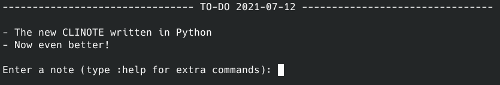

# CLINOTE

The new CLINOTE written in Python. Now even better featuring features like:
- Resetting the file via a command
- Deleting the last note
- Auto-resetting all tasks when the day changes (can be enabled/disabled with `:dc`)
- Better formating

CLINOTE is a perfect TO-DO and note-taking program for people who depend much on the terminal like users of a standalone tiling window manager or just people with a low-end computer.
# Is the C version dead?
Yes.
# Commands
```
:q(uit) - Exit the program
:r(eset) - Reset all notes
:d(elete) - Delete last note
:h(elp) / :? - Get help with commands
:d(ay)c(hange) - Disable/Enable task reset on day change
```
# Installation
Requirements:
- Python3

```
git clone https://github.com/JBNCK/CLINOTE
cd CLINOTE/
chmod 755 install.sh
sudo ./install.sh
```
If you use doas or another "superuser do" application replace the 'sudo' with in the last command with your desired "superuser do" command. Also be aware that if you have any other program with a binary called 'notes' it will get overwritten.
# Removal
```
sudo rm /usr/bin/notes
```
Once again you can replace sudo with your desired "superuser do" if you wish.
